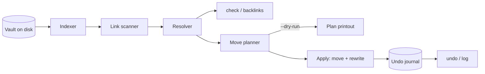

# linkmend

[English](README.md) | [中文](README.zh.md) | [日本語](README.ja.md)

[](LICENSE) [](CHANGELOG.md) [](pyproject.toml)  [](CONTRIBUTING.md)

**オープンソースの Markdown ノート庫リファクタリングツール：ノートの移動・リネームと同時に、そこを指すすべての Markdown リンクと wiki リンクを書き換える——ジャーナル付き・検証済み・アンドゥ可能。**


```bash
git clone https://github.com/JaydenCJ/linkmend && cd linkmend && pip install -e .
```

> **プレリリース：** linkmend はまだ PyPI に公開されていません。最初のリリースまでは [JaydenCJ/linkmend](https://github.com/JaydenCJ/linkmend) をクローンし、リポジトリのルートで `pip install -e .` を実行してください。

## なぜ linkmend なのか？

アプリの外でノート庫を整理すると、リンクは何百単位で壊れます——フォルダの大掃除が何年も先送りされるのはそのためです。既存ツールは二つの陣営に分かれ、どちらも助けてくれません：Obsidian のようなアプリはリネームがアプリの*内側*で起きたときだけリンクを書き換え（シェルスクリプト、同期クライアント、ターミナルの `mv` はすべてのバックリンクを静かに孤立させます）、markdown-link-check や lychee のようなリンターは*事後に*どこが壊れたかを教えるだけで何も直しません。linkmend は欠けていた第三の存在：スクリプト化できるリファクタリング手順です。ノート庫全体の完全なインデックスに基づいて移動を計画し、Markdown リンク・画像・参照定義・Obsidian 流の `[[wiki リンク]]` を一度のアトミックな操作で書き換え——各執筆者の記法を保ち、コードブロックは飛ばし——トランザクション全体をアンドゥジャーナルに記録するため、`linkmend undo` でノート庫をバイト単位で復元できます。リンターは破損を見つける；linkmend は破損を防ぎ、しかも取り消せます。

|  | linkmend | Obsidian | VS Code Markdown | markdown-link-check | lychee |
|---|---|---|---|---|---|
| 移動/リネーム時のリンク書き換え | あり（庫全体の CLI） | アプリ内限定 | エディタ内限定 | なし（検出のみ） | なし（検出のみ） |
| Wiki リンク `[[Note#h\|alias]]` | あり | あり | なし | なし | なし |
| アンドゥ | あり（ジャーナル、バイト単位） | なし | エディタのアンドゥ、1 ファイルずつ | 該当なし | 該当なし |
| スクリプト化 / CI ゲート | あり（`check`、終了コード 1） | なし | なし | あり | あり |
| 曖昧リンクへの誠実さ | 報告のみ、推測しない | 黙って選択 | 該当なし | 該当なし | 該当なし |
| オフライン / ランタイム依存 | あり / 0 | デスクトップアプリ | エディタ | なし（npm、HTTP で検証） | あり / 静的バイナリ |

<sub>比較は 2026-07 時点：markdown-link-check 3.13 は npm 上で 8 個のランタイム依存を宣言し、http(s) ターゲットをネットワーク越しに検証します；lychee と両エディタは検証か書き換えのみで、巻き戻せる記録は残しません。linkmend の依存数は [pyproject.toml](pyproject.toml) の `dependencies = []` です。</sub>

## 機能

- **何を動かしても、すべて繕う** —— `linkmend mv` はノート・添付ファイル・フォルダ丸ごとを移動し、3 種類のリンクをすべて書き換えます：他ノートからの被リンク、移動したノート自身の相対リンク、そして一緒に移動するファイル同士のリンク（後者は正しくゼロ差分）。
- **どのリンク記法も、記法のまま** —— インラインリンク、画像、タイトル、アンカー、参照定義、`<山括弧>` の宛先、パーセントエンコード、拡張子なしパス、エイリアス付き `[[wiki リンク]]`；書き換えは元の記法を保ち、裸の wiki 名はリネームで曖昧になる場合にだけパスへ広げます。
- **設計からアンドゥ可能** —— すべての `mv` はプレーン JSON ジャーナルの番号付きトランザクションとなり、バイト単位のプレイメージと SHA-256 指紋を保存；その後に他の何かがファイルに触れていれば `undo` は拒否し（ファイルごとの競合リスト）、そうでなければノート庫をバイト単位で復元します。
- **曖昧さに正直** —— `Setup.md` という名のノートが 2 つ？ `check` は全候補とともに報告し、`mv` は決して推測で書き換えません——リンクの指す先が静かに入れ替わるのは、直さないより悪いからです。
- **手元で安全** —— 計画は純粋関数なので `--dry-run` が印字するのは正確な編集リストそのもの；適用前に全スパンを再検証し、アトミックに書き込み、非 UTF-8 バイトも無損失で往復させ、`.git` や `.obsidian` などの隠しディレクトリには決して入りません。
- **おまけにリンターでもある** —— `linkmend check` は破損・曖昧リンクがあれば終了コード 1 で CI を止め、ノートを動かす前には `linkmend backlinks` が「誰がここを指しているか？」に答えます。

## クイックスタート

インストール：

```bash
git clone https://github.com/JaydenCJ/linkmend && cd linkmend && pip install -e .
```

任意の Markdown フォルダ（Obsidian の保管庫、docs ツリー、Zettelkasten）に向けて、恐れず整理：

```bash
cd ~/vault
linkmend mv "Projects/Alpha.md" "Archive/2026/Alpha (done).md"
```

```text
moved 1 file, rewrote 8 links in 3 files  (transaction #1)
  Projects/Alpha.md -> Archive/2026/Alpha (done).md
  Projects/Alpha.md: 2 links rewritten
  Projects/Beta.md: 2 links rewritten
  index.md: 4 links rewritten
undo with: linkmend undo 1
```

その後の `index.md`——アンカー、タイトル、wiki リンク、参照定義がすべて無傷で、新パスの空白は自動的に山括弧になった点に注目（実行結果そのまま）：

```text
- [Alpha project](<Archive/2026/Alpha (done).md>)
- [Kickoff](<Archive/2026/Alpha (done).md#kickoff> "notes")
- [[Alpha (done)]] and 

[alpha-ref]: <Archive/2026/Alpha (done).md>
```

何も壊れていないことを証明し、それから気を変える：

```bash
linkmend check && linkmend undo
```

```text
no broken links  (checked 10 links in 3 notes)
undid transaction #1: mv Projects/Alpha.md Archive/2026/Alpha (done).md  (1 file moved back, 3 notes restored)
```

実行可能なサンプル保管庫とワークフロー一式のスクリプトは [`examples/`](examples/) にあります。

## コマンド

| コマンド | 動作 | 終了コード |
|---|---|---|
| `linkmend mv <src> <dst>` | ノート・添付・フォルダを移動/リネームし、影響する全リンクを書き換え、トランザクションを記録 | 0 成功 · 2 競合/エラー |
| `linkmend check` | 破損・曖昧リンクを `ファイル:行` で報告 | 0 クリーン · 1 検出あり |
| `linkmend backlinks <note>` | あるノートに解決されるすべてのリンクを列挙 | 0 |
| `linkmend log` | トランザクションジャーナルを新しい順に表示 | 0 |
| `linkmend undo [id]` | トランザクションを巻き戻す（既定は最新のアクティブ）、バイト単位 | 0 成功 · 1 拒否 · 2 エラー |

| フラグ | 既定値 | 効果 |
|---|---|---|
| `--vault DIR` | `.` | 保管庫ルート；インデックスは決して外に出ない |
| `--dry-run` | オフ | `mv`/`undo`：正確な計画を印字し、何も書かない |
| `--json` | オフ | 安定した機械可読エンベロープ（`tool`、`version`、`command` など） |
| `--force` | オフ | `undo`：その後ファイルが変わっていてもプレイメージを復元 |
| `--limit N` | 全部 | `log`：最大 N 件のトランザクションを表示 |

何がリンクと見なされ、名前がどう解決され、どの記法保持ルールが働くかの完全な仕様は [docs/link-rules.md](docs/link-rules.md) に、トランザクションのファイル形式は [docs/journal-format.md](docs/journal-format.md) にあります。

## 検証

このリポジトリは CI を持ちません；上記の主張はすべてローカル実行で検証しています。このリポジトリのチェックアウトから再現できます：

```bash
pip install -e '.[dev]' && pytest && bash scripts/smoke.sh
```

出力（実際の実行から転記、`...` で省略）：

```text
90 passed in 0.39s
...
[log] #1  ...  mv Projects/Alpha.md Archive/2026/Alpha (done).md  [1 file moved, 3 notes rewritten]  (undone)
SMOKE OK
```

## アーキテクチャ



## ロードマップ

- [x] スキャナ、リゾルバ、記法保持リライタ、`mv`/`check`/`backlinks`/`log`/`undo`、バイト単位のジャーナルトランザクション（v0.1.0）
- [ ] `linkmend fix`：ファジー候補マッチングで既に壊れたリンクを対話的に修復
- [ ] アンカー検証：対象に見出しが存在しない `note.md#heading` リンクを警告
- [ ] `redo`、および一度の検証で済む複数トランザクションの `undo --to <id>`
- [ ] PyPI への公開（`pip install linkmend`）

全リストは [open issues](https://github.com/JaydenCJ/linkmend/issues) を参照してください。

## コントリビュート

コントリビュート歓迎です——まずは [good first issue](https://github.com/JaydenCJ/linkmend/issues?q=is%3Aissue+is%3Aopen+label%3A%22good+first+issue%22) から、あるいは [discussion](https://github.com/JaydenCJ/linkmend/discussions) を立ててください。開発環境の構築は [CONTRIBUTING.md](CONTRIBUTING.md) を参照。

## ライセンス

[MIT](LICENSE)
