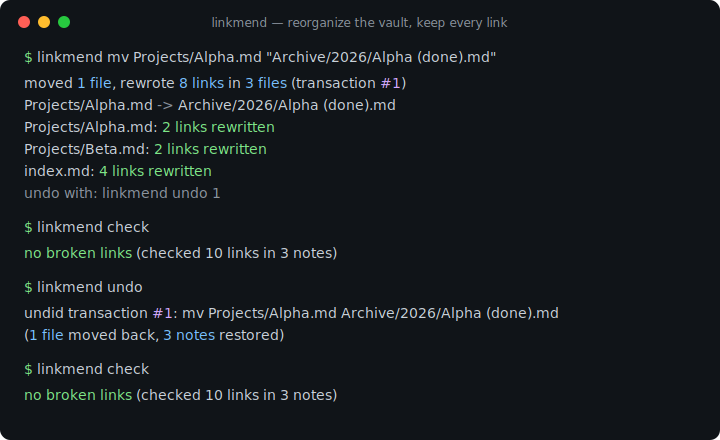
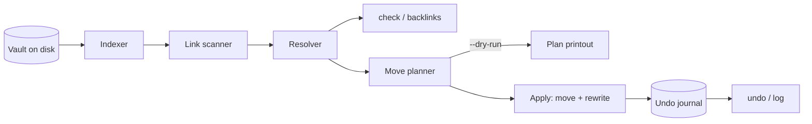

# linkmend

[English](README.md) | [中文](README.zh.md) | [日本語](README.ja.md)

[](LICENSE) [](CHANGELOG.md) [](pyproject.toml)  [](CONTRIBUTING.md)

**Open-source refactoring for Markdown vaults: move and rename notes while every Markdown and wiki link pointing at them is rewritten — journaled, verified, undoable.**



```bash
git clone https://github.com/JaydenCJ/linkmend && cd linkmend && pip install -e .
```

> **Pre-release:** linkmend is not yet published to PyPI. Until the first release, clone [JaydenCJ/linkmend](https://github.com/JaydenCJ/linkmend) and run `pip install -e .` from the repository root.

## Why linkmend?

Reorganizing a vault outside its app breaks links by the hundred, which is why folder cleanups get postponed for years. The existing tools split into two camps that both leave you stranded: apps like Obsidian rewrite links only when the rename happens *inside* the app (a shell script, a sync client, or `mv` in a terminal silently orphans every backlink), and linters like markdown-link-check or lychee tell you *after the fact* what is already broken without fixing anything. linkmend is the missing third thing: a scriptable refactoring step. It plans the move against a full index of your vault, rewrites Markdown links, images, reference definitions, and Obsidian-style `[[wiki links]]` in one atomic pass — preserving each author's style, skipping code blocks — and records the whole transaction in an undo journal, so `linkmend undo` restores the vault byte-for-byte. Linters find breakage; linkmend prevents it, and lets you take it back.

|  | linkmend | Obsidian | VS Code Markdown | markdown-link-check | lychee |
|---|---|---|---|---|---|
| Rewrites links on move/rename | Yes (vault-wide CLI) | Only inside the app | Only inside the editor | No (detects only) | No (detects only) |
| Wiki links `[[Note#h\|alias]]` | Yes | Yes | No | No | No |
| Undo | Yes (journal, byte-exact) | No | Editor undo, one file at a time | n/a | n/a |
| Scriptable / CI gate | Yes (`check`, exit 1) | No | No | Yes | Yes |
| Ambiguous-link honesty | Reported, never guessed | Silent pick | n/a | n/a | n/a |
| Offline / runtime deps | Yes / 0 | desktop app | editor | No (npm, checks over HTTP) | Yes / static binary |

<sub>Comparison as of 2026-07: markdown-link-check 3.13 declares 8 runtime npm dependencies and validates http(s) targets over the network; lychee and both editors validate or rewrite but keep no reversible record. linkmend's count is `dependencies = []` in [pyproject.toml](pyproject.toml).</sub>

## Features

- **Move anything, mend everything** — `linkmend mv` relocates a note, an attachment, or a whole folder and rewrites all three link populations: inbound links from other notes, the moved note's own relative links, and links between co-moved files (which correctly produce zero churn).
- **Every link style, kept in style** — inline links, images, titles, anchors, reference definitions, `<angle>` destinations, percent-encoding, extensionless paths, and `[[wiki links]]` with aliases; each rewrite preserves the original notation, and bare wiki names widen to a path only when a rename would make them ambiguous.
- **Undoable by design** — every `mv` is a numbered transaction in a plain-JSON journal storing byte-exact pre-images plus SHA-256 fingerprints; `undo` refuses (per-file conflict list) if anything else touched those files since, and otherwise restores the vault byte-for-byte.
- **Honest about ambiguity** — two notes named `Setup.md`? `check` reports the tie with all candidates and `mv` never rewrites a guess, because silently flipping a link's target is worse than leaving it.
- **Safe under your fingers** — planning is pure so `--dry-run` prints the exact edit list; apply re-verifies every span before touching anything, writes atomically, round-trips non-UTF-8 bytes, and never follows hidden directories like `.git` or `.obsidian`.
- **A linter too, for free** — `linkmend check` gates CI with exit code 1 on broken or ambiguous links, and `linkmend backlinks` answers "who points here?" before you move a note.

## Quickstart

Install:

```bash
git clone https://github.com/JaydenCJ/linkmend && cd linkmend && pip install -e .
```

Point it at any folder of Markdown (an Obsidian vault, a docs tree, a Zettelkasten) and reorganize fearlessly:

```bash
cd ~/vault
linkmend mv "Projects/Alpha.md" "Archive/2026/Alpha (done).md"
```

```text
moved 1 file, rewrote 8 links in 3 files  (transaction #1)
  Projects/Alpha.md -> Archive/2026/Alpha (done).md
  Projects/Alpha.md: 2 links rewritten
  Projects/Beta.md: 2 links rewritten
  index.md: 4 links rewritten
undo with: linkmend undo 1
```

`index.md` afterwards — note the anchor, the title, the wiki link, and the reference definition all survived, and the new spaces forced angle brackets (real captured output):

```text
- [Alpha project](<Archive/2026/Alpha (done).md>)
- [Kickoff](<Archive/2026/Alpha (done).md#kickoff> "notes")
- [[Alpha (done)]] and 

[alpha-ref]: <Archive/2026/Alpha (done).md>
```

Prove nothing broke, then change your mind:

```bash
linkmend check && linkmend undo
```

```text
no broken links  (checked 10 links in 3 notes)
undid transaction #1: mv Projects/Alpha.md Archive/2026/Alpha (done).md  (1 file moved back, 3 notes restored)
```

A runnable sample vault and the full workflow script live in [`examples/`](examples/).

## Commands

| Command | What it does | Exit codes |
|---|---|---|
| `linkmend mv <src> <dst>` | Move/rename a note, attachment, or folder; rewrite every affected link; record a transaction | 0 ok · 2 conflict/error |
| `linkmend check` | Report broken and ambiguous links with `file:line` locations | 0 clean · 1 findings |
| `linkmend backlinks <note>` | List every link that resolves to a note | 0 |
| `linkmend log` | Show the transaction journal, newest first | 0 |
| `linkmend undo [id]` | Reverse a transaction (default: newest active), byte-for-byte | 0 ok · 1 refused · 2 error |

| Flag | Default | Effect |
|---|---|---|
| `--vault DIR` | `.` | Vault root; the index never leaves it |
| `--dry-run` | off | `mv`/`undo`: print the exact plan, write nothing |
| `--json` | off | Stable machine-readable envelope (`tool`, `version`, `command`, …) |
| `--force` | off | `undo`: restore pre-images even if files changed since |
| `--limit N` | all | `log`: show at most N transactions |

What counts as a link, how names resolve, and every style-preservation rule are specified in [docs/link-rules.md](docs/link-rules.md); the transaction file format is in [docs/journal-format.md](docs/journal-format.md).

## Verification

This repository ships no CI; every claim above is verified by local runs. Reproduce them from a checkout of this repository:

```bash
pip install -e '.[dev]' && pytest && bash scripts/smoke.sh
```

Output (copied from a real run, truncated with `...`):

```text
90 passed in 0.39s
...
[log] #1  ...  mv Projects/Alpha.md Archive/2026/Alpha (done).md  [1 file moved, 3 notes rewritten]  (undone)
SMOKE OK
```

## Architecture



## Roadmap

- [x] Scanner, resolver, style-preserving rewriter, `mv`/`check`/`backlinks`/`log`/`undo`, journaled byte-exact transactions (v0.1.0)
- [ ] `linkmend fix`: interactively repair already-broken links via fuzzy candidate matching
- [ ] Anchor validation: flag `note.md#heading` links whose heading does not exist
- [ ] `redo`, and multi-transaction `undo --to <id>` with a single verification pass
- [ ] PyPI release with `pip install linkmend`

See the [open issues](https://github.com/JaydenCJ/linkmend/issues) for the full list.

## Contributing

Contributions are welcome — start with a [good first issue](https://github.com/JaydenCJ/linkmend/issues?q=is%3Aissue+is%3Aopen+label%3A%22good+first+issue%22) or open a [discussion](https://github.com/JaydenCJ/linkmend/discussions). See [CONTRIBUTING.md](CONTRIBUTING.md) for the development setup.

## License

[MIT](LICENSE)
