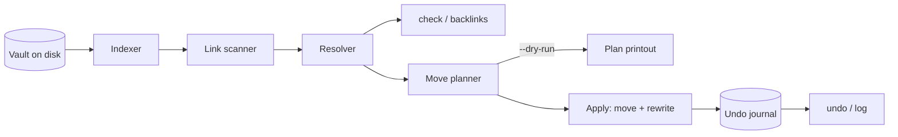

# linkmend

[English](README.md) | [中文](README.zh.md) | [日本語](README.ja.md)

[](LICENSE) [](CHANGELOG.md) [](pyproject.toml)  [](CONTRIBUTING.md)

**开源的 Markdown 笔记库重构工具：移动、重命名笔记的同时，重写所有指向它们的 Markdown 链接和 wiki 链接——有日志、可校验、可撤销。**


```bash
git clone https://github.com/JaydenCJ/linkmend && cd linkmend && pip install -e .
```

> **预发布：** linkmend 尚未发布到 PyPI。在首个正式版之前，请克隆 [JaydenCJ/linkmend](https://github.com/JaydenCJ/linkmend) 并在仓库根目录运行 `pip install -e .`。

## 为什么选 linkmend？

在 app 之外整理笔记库，链接会成百上千地断掉——这正是文件夹大扫除被拖延多年的原因。现有工具分成两个阵营，但都帮不上忙：Obsidian 这类 app 只在重命名发生在 app *内部*时才重写链接（shell 脚本、同步客户端或终端里的 `mv` 会悄无声息地孤立所有反向链接）；而 markdown-link-check、lychee 这类 linter 只能*事后*告诉你哪里已经断了，什么也不修。linkmend 是缺失的第三种东西：一个可脚本化的重构步骤。它基于整个笔记库的完整索引来规划移动，在一次原子操作中重写 Markdown 链接、图片、引用定义和 Obsidian 风格的 `[[wiki 链接]]`——保留每位作者的书写风格、跳过代码块——并把整个事务记入撤销日志，`linkmend undo` 能把笔记库逐字节还原。linter 发现损坏；linkmend 阻止损坏，还能让你反悔。

|  | linkmend | Obsidian | VS Code Markdown | markdown-link-check | lychee |
|---|---|---|---|---|---|
| 移动/重命名时重写链接 | 是（全库 CLI） | 仅限 app 内部 | 仅限编辑器内部 | 否（仅检测） | 否（仅检测） |
| Wiki 链接 `[[Note#h\|alias]]` | 是 | 是 | 否 | 否 | 否 |
| 撤销 | 是（日志，逐字节精确） | 否 | 编辑器撤销，一次一个文件 | 不适用 | 不适用 |
| 可脚本化 / CI 门禁 | 是（`check`，退出码 1） | 否 | 否 | 是 | 是 |
| 对歧义链接诚实 | 如实上报，绝不猜 | 静默选择 | 不适用 | 不适用 | 不适用 |
| 离线 / 运行时依赖 | 是 / 0 | 桌面 app | 编辑器 | 否（npm，走 HTTP 校验） | 是 / 静态二进制 |

<sub>对比截至 2026-07：markdown-link-check 3.13 在 npm 上声明 8 个运行时依赖，且通过网络校验 http(s) 目标；lychee 与两款编辑器只做校验或重写，均不保留可回退的记录。linkmend 的依赖数即 [pyproject.toml](pyproject.toml) 中的 `dependencies = []`。</sub>

## 功能

- **移动任何东西，修好所有链接** —— `linkmend mv` 可移动一篇笔记、一个附件或整个文件夹，并重写全部三类链接：其他笔记指向它的入链、被移动笔记自身的相对链接、以及一起移动的文件之间的链接（后者正确地零改动）。
- **每种链接风格，原样保留** —— 行内链接、图片、标题、锚点、引用定义、`<尖括号>` 目标、百分号编码、免扩展名路径，以及带别名的 `[[wiki 链接]]`；每次重写都保留原有写法，裸 wiki 名只在重命名会造成歧义时才扩写成路径。
- **生来可撤销** —— 每次 `mv` 都是纯 JSON 日志里一条带编号的事务，保存逐字节前像和 SHA-256 指纹；若其间有别的东西动过这些文件，`undo` 会拒绝（逐文件列出冲突），否则将笔记库逐字节还原。
- **对歧义坦诚** —— 两篇都叫 `Setup.md` 的笔记？`check` 会连同所有候选一起上报，`mv` 绝不按猜测重写——悄悄改变链接指向比不改更糟。
- **在你手下很安全** —— 规划是纯函数，所以 `--dry-run` 打印的就是精确的编辑清单；应用前逐一复核每个跨度、原子写入、无损往返非 UTF-8 字节，且从不进入 `.git`、`.obsidian` 等隐藏目录。
- **顺带还是个 linter** —— `linkmend check` 在链接损坏或歧义时以退出码 1 卡住 CI；移动之前，`linkmend backlinks` 先回答"谁指向这里？"。

## 快速上手

安装：

```bash
git clone https://github.com/JaydenCJ/linkmend && cd linkmend && pip install -e .
```

指向任意 Markdown 文件夹（Obsidian 库、docs 目录树、Zettelkasten），放心整理：

```bash
cd ~/vault
linkmend mv "Projects/Alpha.md" "Archive/2026/Alpha (done).md"
```

```text
moved 1 file, rewrote 8 links in 3 files  (transaction #1)
  Projects/Alpha.md -> Archive/2026/Alpha (done).md
  Projects/Alpha.md: 2 links rewritten
  Projects/Beta.md: 2 links rewritten
  index.md: 4 links rewritten
undo with: linkmend undo 1
```

之后的 `index.md`——注意锚点、标题、wiki 链接和引用定义全都完好，新路径里的空格自动改用尖括号（真实运行输出）：

```text
- [Alpha project](<Archive/2026/Alpha (done).md>)
- [Kickoff](<Archive/2026/Alpha (done).md#kickoff> "notes")
- [[Alpha (done)]] and 

[alpha-ref]: <Archive/2026/Alpha (done).md>
```

证明什么都没断，然后随时反悔：

```bash
linkmend check && linkmend undo
```

```text
no broken links  (checked 10 links in 3 notes)
undid transaction #1: mv Projects/Alpha.md Archive/2026/Alpha (done).md  (1 file moved back, 3 notes restored)
```

可运行的示例笔记库和完整工作流脚本在 [`examples/`](examples/)。

## 命令

| 命令 | 作用 | 退出码 |
|---|---|---|
| `linkmend mv <src> <dst>` | 移动/重命名笔记、附件或文件夹；重写所有受影响的链接；记录一条事务 | 0 成功 · 2 冲突/错误 |
| `linkmend check` | 以 `文件:行号` 报告损坏和歧义链接 | 0 干净 · 1 有发现 |
| `linkmend backlinks <note>` | 列出解析到某篇笔记的所有链接 | 0 |
| `linkmend log` | 显示事务日志，最新在前 | 0 |
| `linkmend undo [id]` | 回退一条事务（默认最新的活动事务），逐字节精确 | 0 成功 · 1 被拒绝 · 2 错误 |

| 选项 | 默认值 | 效果 |
|---|---|---|
| `--vault DIR` | `.` | 笔记库根目录；索引绝不越出它 |
| `--dry-run` | 关 | `mv`/`undo`：打印精确计划，不写任何东西 |
| `--json` | 关 | 稳定的机读信封（`tool`、`version`、`command` 等字段） |
| `--force` | 关 | `undo`：即使文件其后被改过也强制还原前像 |
| `--limit N` | 全部 | `log`：最多显示 N 条事务 |

什么算链接、名字如何解析、每条风格保留规则的完整规范在 [docs/link-rules.md](docs/link-rules.md)；事务文件格式在 [docs/journal-format.md](docs/journal-format.md)。

## 验证

本仓库不带 CI；上述所有论断都由本地运行验证。从本仓库的检出即可复现：

```bash
pip install -e '.[dev]' && pytest && bash scripts/smoke.sh
```

输出（摘自真实运行，用 `...` 截断）：

```text
90 passed in 0.39s
...
[log] #1  ...  mv Projects/Alpha.md Archive/2026/Alpha (done).md  [1 file moved, 3 notes rewritten]  (undone)
SMOKE OK
```

## 架构



## 路线图

- [x] 扫描器、解析器、保风格重写器、`mv`/`check`/`backlinks`/`log`/`undo`、逐字节精确的日志事务（v0.1.0）
- [ ] `linkmend fix`：通过模糊候选匹配交互式修复已断链接
- [ ] 锚点校验：标记目标里不存在对应标题的 `note.md#heading` 链接
- [ ] `redo`，以及一次校验完成的多事务 `undo --to <id>`
- [ ] 发布到 PyPI，支持 `pip install linkmend`

完整列表见 [open issues](https://github.com/JaydenCJ/linkmend/issues)。

## 贡献

欢迎贡献——从 [good first issue](https://github.com/JaydenCJ/linkmend/issues?q=is%3Aissue+is%3Aopen+label%3A%22good+first+issue%22) 入手，或发起一个 [discussion](https://github.com/JaydenCJ/linkmend/discussions)。开发环境搭建见 [CONTRIBUTING.md](CONTRIBUTING.md)。

## 许可证

[MIT](LICENSE)
